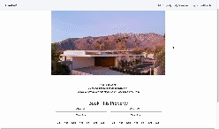
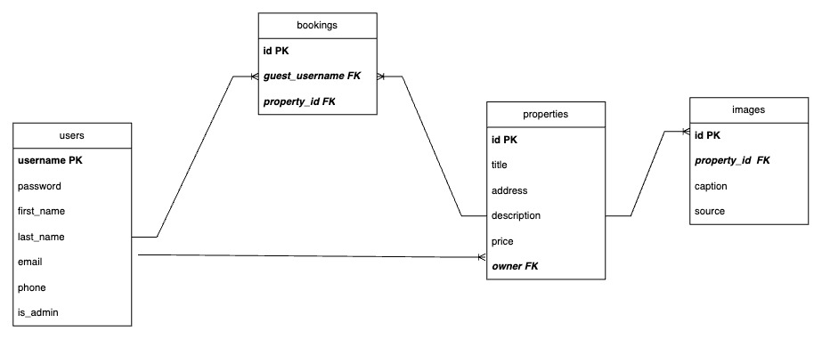
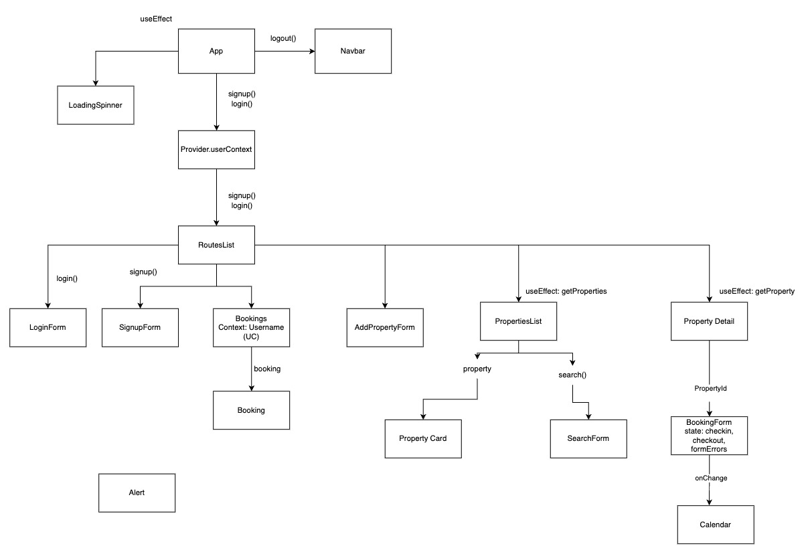
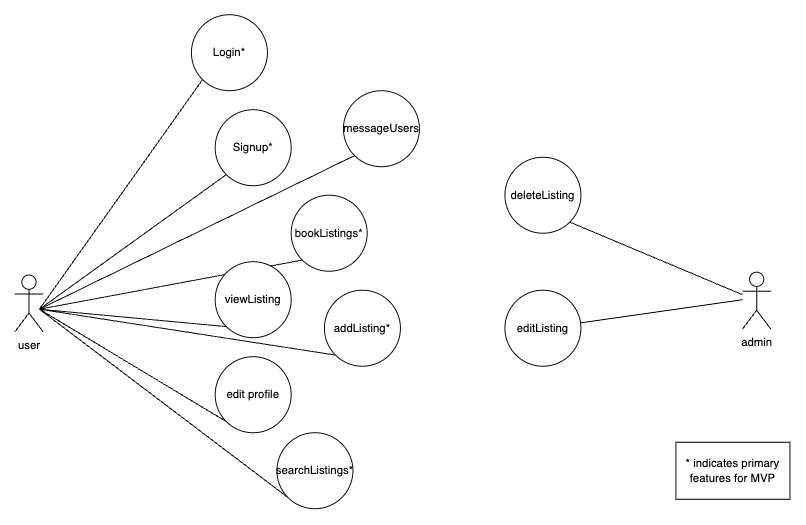

# ShareBnB

Sharebnb is a full stack web application for people to share and rent out their outdoor spaces with others. As we move towards a world where people share more and more things, it’s time we build an application where users can share outdoor spaces like backyards or pools!

## [Live Demo Link](https://sharebnb-getaway.surge.sh/)

## Features

### General Features:

- Secure user authentication and registration (login, sign up, logout)
- Authenticated users can create, view, edit, and delete property listings
- Authenticated users can book properties and view all of their reserved bookings
- Uploaded photos are stored and managed in AWS S3 cloud storage
- Search and filter listings by various criteria such as location and price

### Backend Features:

- PostgreSQL database for managing users, listings, and bookings
- RESTful API endpoints for CRUD operations on users, listings, and bookings
- Data validation and schema enforcement with JSON Schema
- Middleware for authentication and error handling

### Frontend Features:

- Responsive design optimized for various devices
- User-friendly forms with validation for authentication, listing management, and booking
- Real-time calendar integration for listing availability
- Dynamic and interactive user interface built with React

## Getting Started

To get started with ShareBnB, follow the steps below:

### Backend

1. Clone the repository to your local machine.
2. Navigate to the backend directory: `cd backend`.
3. Install backend dependencies with `npm install`.
4. Start the backend server with `npm start`.
5. The backend server will start running at `http://localhost:3001`.

### Frontend

1. Open a new terminal.
2. Navigate to the frontend directory: `cd frontend`.
3. Install dependencies with `npm install`.
4. Start the frontend development server with `npm start`.
5. Open `http://localhost:5173` in your browser.

## Tech Stack

- AWS S3 cloud storage
- PostgreSQL for database
- Node/Express for backend
- React for frontend

## Dependencies

Backend:

- express
- cors
- dotenv
- bcrypt
- jsonwebtoken
- jsonschema
- multer
- pg

Frontend:

- bootstrap
- react
- react-dom
- react-router-dom
- react-calendar
- react-jwt
- reactstrap
- jwt-decode

## Illustrations

### Database Relationship Modelling

### React Component Hierarchy

### User Case Diagram

## Authors

- Gracee Gallivan
- Ben Briones (pair programming partner)
